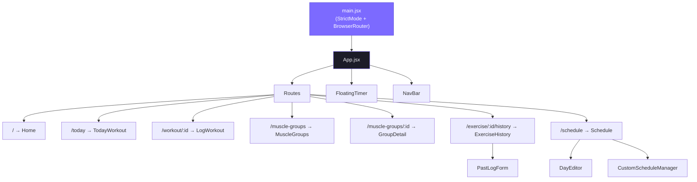
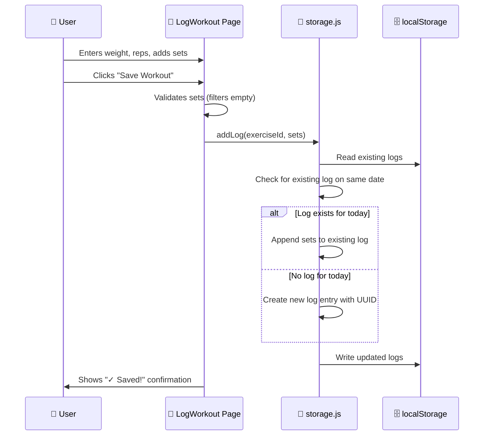
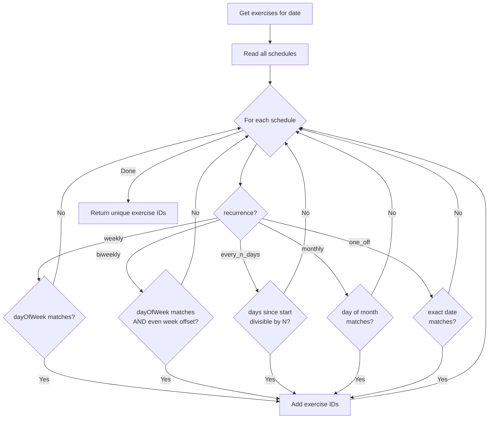
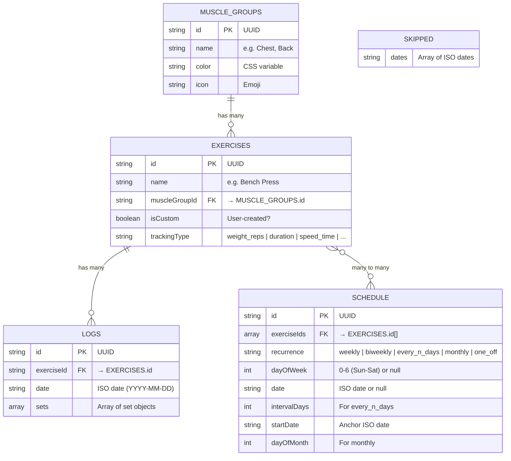

<


</div>

---

## 📖 Table of Contents

- [Overview](#-overview)
- [Features](#-features)
- [Architecture](#-architecture)
- [Data Flow](#-data-flow)
- [Data Model](#-data-model)
- [Project Structure](#-project-structure)
- [File-by-File Breakdown](#-file-by-file-breakdown)
- [Tech Stack](#-tech-stack)
- [Getting Started](#-getting-started)
- [How to Recreate](#-how-to-recreate)

---

## 🌟 Overview

**GymTrack** is a single-page application (SPA) designed for gym-goers who want a clean, offline-first workout tracker. The app runs entirely in the browser using `localStorage` for persistence — no account or server required. It features a dark-themed, glassmorphism UI with smooth animations and a mobile-first responsive layout.

### Key Highlights

- 🗓️ **Flexible Scheduling** — Weekly, biweekly, every-N-days, monthly, and one-off workout schedules
- 📊 **Progress Charts** — Visual line charts tracking performance over time using Chart.js
- ⏱️ **Floating Rest Timer** — A built-in countdown/stopwatch accessible from any screen
- 💪 **7 Muscle Groups, 35+ Exercises** — Pre-loaded with common exercises, fully customizable
- 📐 **Multiple Tracking Types** — Weight & Reps, Duration, Speed & Time, Distance, Incline
- 🔥 **Streak Counter** — Tracks consecutive workout days to keep you motivated
- ⏭️ **Skip & Reschedule** — Miss a day? Reschedule to another day or push the whole week forward
- 📅 **Month Calendar View** — Overview of the entire month's planned workouts
- 📝 **Log Past Sessions** — Retroactively add workout data for previous dates

---

## ✨ Features

### 🏠 Home Dashboard
- Dynamic greeting based on time of day (morning/afternoon/evening)
- Current day streak display with fire animation
- Today's workout summary card with progress bar
- Quick navigation links to Muscle Groups and Schedule

### 🏋️ Today's Workout
- Lists all exercises scheduled for today
- Shows completion status (✓) for logged exercises
- Displays last session data for quick reference
- Skip & Reschedule modal with two options:
  - Reschedule to a specific day within next 7 days
  - Push the entire weekly schedule forward by 1 day

### 📝 Log Workout
- Dynamic form fields based on exercise tracking type
- Add/remove multiple sets
- Recent session history for reference
- Save confirmation with success animation
- Link to full exercise history

### 💪 Muscle Groups
- Visual grid of 7 muscle groups with color-coded cards
- Exercise count per group
- Glass-card design with glow effects

### 📋 Group Detail
- Browse exercises within a muscle group
- View last session summary for each exercise
- Add custom exercises with selectable tracking type
- Delete custom exercises
- Navigate to full exercise history

### 📊 Exercise History
- Interactive line chart showing progress over time
- Best performance and session count stats
- Full session log with per-set breakdown
- Delete individual sessions
- Log past sessions with date picker

### 📅 Schedule Manager
- **Week View**: 7-day strip with exercise counts, tap to edit
- **Month View**: Full calendar with dot indicators, navigate months
- **Day Editor**: Pick exercises from any muscle group, set recurrence (weekly/biweekly)
- **Custom Schedules**: Create every-N-days or monthly recurring schedules
- Google Calendar embed integration

### ⏱️ Floating Timer
- Always-accessible floating action button (FAB)
- **Rest Timer**: Presets (30s, 1:00, 1:30, 2:00, 3:00, 5:00) + custom duration
- **Stopwatch**: Count-up timer for timed exercises
- Visual ring progress indicator on FAB
- Audio alarm (triple beep) when rest timer finishes
- Minimized view shows countdown on the FAB itself

---

## 🏗️ Architecture

### Application Architecture Diagram

```mermaid
graph TB
    subgraph Browser["🌐 Browser"]
        subgraph React["⚛️ React Application"]
            Router["React Router DOM<br/>(BrowserRouter)"]
            
            subgraph Pages["📄 Pages"]
                Home["🏠 Home"]
                Today["🏋️ TodayWorkout"]
                Log["📝 LogWorkout"]
                MG["💪 MuscleGroups"]
                GD["📋 GroupDetail"]
                EH["📊 ExerciseHistory"]
                Sched["📅 Schedule"]
            end
            
            subgraph Components["🧩 Shared Components"]
                Nav["NavBar"]
                Timer["FloatingTimer"]
            end
            
            subgraph DataLayer["💾 Data Layer"]
                Storage["storage.js<br/>(CRUD API)"]
                Seed["seed.js<br/>(Default Data + Config)"]
            end
        end
        
        subgraph Persistence["🗄️ Persistence"]
            LS["localStorage<br/>(JSON key-value store)"]
        end
    end
    
    Router --> Pages
    Pages --> DataLayer
    DataLayer --> LS
    Components --> |"Visible on all pages"| Router
    
    style Browser fill:#0f0f13,stroke:#333,color:#f0f0f5
    style React fill:#16161d,stroke:#7c6aff,color:#f0f0f5
    style Pages fill:#1c1c28,stroke:#555,color:#f0f0f5
    style Components fill:#1c1c28,stroke:#555,color:#f0f0f5
    style DataLayer fill:#1c1c28,stroke:#555,color:#f0f0f5
    style Persistence fill:#1c1c28,stroke:#7c6aff,color:#f0f0f5
```



### Component Hierarchy



---

## 🔄 Data Flow

### Workout Logging Flow



### Schedule Evaluation Flow



---

## 📐 Data Model

### localStorage Keys & Schemas



### Tracking Types

| Type | Fields | Example Summary | Chart Metric |
|------|--------|-----------------|--------------|
| `weight_reps` | Weight (kg), Reps | `60kg × 12` | Max Weight |
| `duration` | Duration (min) | `2 min` | Duration |
| `speed_time` | Speed (km/h), Time (min) | `12 km/h · 30 min` | Speed |
| `speed_time_incline` | Speed, Time, Incline (%) | `10 km/h · 25 min · 5%` | Speed |
| `time_distance` | Time (min), Distance (km) | `2.5 km · 20 min` | Distance |
| `time_incline` | Time (min), Incline (%) | `15 min · 8% incline` | Duration |

### localStorage Key Mapping

| Key | Type | Description |
|-----|------|-------------|
| `gm_muscle_groups` | Array | All muscle group objects |
| `gm_exercises` | Array | All exercise objects |
| `gm_schedule` | Array | All schedule entries |
| `gm_logs` | Array | All workout log entries |
| `gm_skipped` | Array | Skipped date ISO strings |
| `gm_initialized` | String | `"true"` flag to prevent re-seeding |

---

## 📂 Project Structure

```
gym-app-v1/
├── index.html                  # Entry HTML with meta tags, fonts, theme
├── package.json                # Dependencies and scripts
├── vite.config.js              # Vite configuration
├── public/
│   └── vite.svg                # Favicon
└── src/
    ├── main.jsx                # React root + BrowserRouter
    ├── App.jsx                 # Route definitions + layout
    ├── index.css               # Global styles + design system
    ├── supabase.js             # Supabase client (placeholder)
    ├── components/
    │   ├── NavBar.jsx          # Bottom navigation bar
    │   ├── NavBar.css          # NavBar styles
    │   ├── FloatingTimer.jsx   # FAB timer (rest + stopwatch)
    │   └── FloatingTimer.css   # Timer styles
    ├── db/
    │   ├── seed.js             # Default data + tracking config
    │   └── storage.js          # localStorage CRUD API
    └── pages/
        ├── Home.jsx            # Dashboard page
        ├── Home.css
        ├── TodayWorkout.jsx    # Today's exercises + skip modal
        ├── TodayWorkout.css
        ├── LogWorkout.jsx      # Log sets for an exercise
        ├── LogWorkout.css
        ├── MuscleGroups.jsx    # Muscle group grid
        ├── MuscleGroups.css
        ├── GroupDetail.jsx     # Exercises within a group
        ├── GroupDetail.css
        ├── ExerciseHistory.jsx # Progress chart + session logs
        ├── ExerciseHistory.css
        ├── Schedule.jsx        # Week/month views + editors
        └── Schedule.css
```

---

## 📝 File-by-File Breakdown

This section explains every file in detail so you can recreate the app from scratch.

---

### `index.html`

The root HTML file served by Vite. Sets up:
- **Charset & viewport** meta tags
- **SEO**: description meta, theme-color
- **Google Fonts**: `Inter` with weights 300–900
- **Title**: "GymTrack – Your Personal Workout Companion"
- **Root div** `#root` where React mounts

---

### `package.json`

**Dependencies:**
| Package | Version | Purpose |
|---------|---------|---------|
| `react` | ^19.2 | UI framework |
| `react-dom` | ^19.2 | React DOM renderer |
| `react-router-dom` | ^7.13 | Client-side routing |
| `chart.js` | ^4.5 | Chart rendering engine |
| `react-chartjs-2` | ^5.3 | React wrapper for Chart.js |
| `uuid` | ^13.0 | Generate unique IDs |
| `@supabase/supabase-js` | ^2.98 | Supabase client (placeholder) |

**Scripts:**
- `dev` → Runs Vite dev server
- `build` → Production build
- `preview` → Preview production build

---

### `vite.config.js`

Minimal Vite config with the `@vitejs/plugin-react` plugin. No custom aliases or advanced configuration.

---

### `src/main.jsx`

The React entry point:
1. Imports `StrictMode` from React
2. Wraps the app in `BrowserRouter` from `react-router-dom`
3. Renders `<App />` into `#root`

---

### `src/App.jsx`

The root component that:
1. Calls `initializeData()` on mount (seeds default data if first run)
2. Defines all routes via `<Routes>`:

| Path | Component | Description |
|------|-----------|-------------|
| `/` | `Home` | Dashboard |
| `/today` | `TodayWorkout` | Today's exercises |
| `/workout/:exerciseId` | `LogWorkout` | Log sets |
| `/muscle-groups` | `MuscleGroups` | Group grid |
| `/muscle-groups/:groupId` | `GroupDetail` | Group exercises |
| `/exercise/:exerciseId/history` | `ExerciseHistory` | Progress charts |
| `/schedule` | `Schedule` | Schedule manager |

3. Renders `<FloatingTimer />` and `<NavBar />` globally (visible on all pages)

---

### `src/index.css`

The global stylesheet containing the **entire design system**:

- **CSS Variables**: Colors, spacing, border-radius, font sizes
- **Dark Theme**: Background `#0f0f13`, card surfaces `#16161d`
- **Accent Colors**: Purple `#7c6aff`, muscle group colors (chest red, back blue, etc.)
- **Glassmorphism**: `.glass-card` with backdrop-blur, semi-transparent backgrounds
- **Typography**: Inter font family, various weight classes
- **Components**: Buttons (`.btn`, `.btn-primary`, `.btn-secondary`, `.btn-danger`), inputs, badges, modals
- **Animations**: `fadeInUp` entrance animation, hover transforms
- **Responsive**: Designed for mobile-first, `max-width: 480px` container
- **Bottom nav spacing**: `padding-bottom: 100px` on `.page` for NavBar clearance

---

### `src/supabase.js`

A placeholder Supabase client. Currently has:
- Placeholder URL and anon key strings
- Creates and exports a Supabase client instance
- **Not actively used** — the app runs on localStorage only

---

### `src/db/seed.js`

Contains all seed data and tracking configuration:

**`defaultMuscleGroups`** — Array of 7 groups:
- Chest 🫁, Back 🔙, Shoulders 💪, Arms 🦾, Legs 🦵, Core 🎯, Cardio ❤️‍🔥
- Each has a UUID, name, CSS color variable, and emoji icon

**`generateDefaultExercises(groups)`** — Creates 35 default exercises:
- 6 Chest exercises (Bench Press, Incline Dumbbell Press, Cable Flyes, Push-Ups, Dumbbell Flyes, Chest Dips)
- 6 Back exercises (Deadlift, Pull-Ups, Barbell Row, Lat Pulldown, Seated Cable Row, T-Bar Row)
- 5 Shoulder exercises (Overhead Press, Lateral Raises, Front Raises, Face Pulls, Arnold Press)
- 6 Arm exercises (Barbell Curl, Tricep Pushdown, Hammer Curl, Skull Crushers, Preacher Curl, Overhead Tricep Extension)
- 7 Leg exercises (Squat, Leg Press, Romanian Deadlift, Leg Curl, Leg Extension, Calf Raises, Bulgarian Split Squat)
- 5 Core exercises (Plank, Hanging Leg Raises, Cable Crunch, Russian Twists, Ab Wheel Rollout)
- 5 Cardio exercises (Treadmill Run, Rowing Machine, Cycling, Jump Rope, Stair Climber)

**`TRACKING_FIELDS`** — Configuration object defining 6 tracking types. Each type specifies:
- `label`: Display name
- `fields[]`: Array of input field definitions (key, label, unit, type, step)
- `summary(set)`: Function to format a set as readable text
- `chartValue(sets)`: Function to extract the value plotted on charts
- `chartLabel`: Y-axis label for the chart

**`getTrackingConfig(type)`** — Returns the config for a given tracking type, falling back to `weight_reps`.

---

### `src/db/storage.js`

The **core data access layer** — a module of pure functions that read/write localStorage:

**Helpers:**
- `read(key)` → Parse JSON from localStorage, return `[]` on error
- `write(key, data)` → Stringify and save to localStorage

**Initialization:**
- `initializeData()` → Seeds default muscle groups, exercises, and empty schedule/logs on first run. Checks `gm_initialized` flag to prevent re-seeding.

**Muscle Groups (CRUD):**
- `getMuscleGroups()` → Get all muscle groups
- `getMuscleGroupById(id)` → Find a single group

**Exercises (CRUD):**
- `getExercises()` → All exercises
- `getExerciseById(id)` → Single exercise
- `getExercisesByGroup(groupId)` → Filter by muscle group
- `addExercise(name, groupId, trackingType)` → Create custom exercise with UUID
- `deleteExercise(id)` → Remove exercise and clean up schedule references

**Schedule (Complex):**
- `getSchedules()` → All schedule entries
- `getScheduleForDay(dayOfWeek)` → Weekly schedules matching a day
- `getScheduleForDate(dateISO)` → One-off schedules matching a date
- `getExerciseIdsForDate(dateISO)` → **Core evaluation function** — evaluates ALL recurrence rules (weekly, biweekly, every_n_days, monthly, one_off) to determine which exercises apply to a given date
- `getTodaySchedule()` → Combines above for today, respecting skip status
- `addScheduleEntry(entry)` → Add a new schedule
- `removeScheduleEntry(id)` → Delete a schedule
- `setScheduleForDay(day, ids, recurrence, options)` → Replace schedule for a weekday
- `setScheduleForDate(dateISO, ids)` → Set one-off schedule for a date

**Logs (CRUD):**
- `getLogs()` → All workout logs
- `getLogsByExercise(exerciseId)` → Logs for an exercise, sorted newest first
- `getLogsByDate(dateISO)` → Logs for a specific date
- `getLastNSessions(exerciseId, n)` → Most recent N sessions
- `addLog(exerciseId, sets, customDateISO?)` → Append sets; merges with existing log if same exercise+date
- `deleteLog(logId)` → Remove a log entry

**Streak:**
- `getStreak()` → Calculates consecutive workout days by checking unique log dates backward from today

**Skip / Reschedule:**
- `isDateSkipped(dateISO)` → Check if a date is in the skipped list
- `unskipDate(dateISO)` → Remove a date from skipped list
- `skipAndReschedule(targetDateISO)` → Mark today as skipped, copy exercises to target date as one-off
- `pushScheduleByOneDay()` → Shift all weekly `dayOfWeek` values forward by 1

**Utilities:**
- `getTodayISO()` → Current date as ISO string
- `getDayName(day)` / `getDayShort(day)` → Full/short weekday names
- `formatDate(dateISO)` → Human-readable date format
- `getDateISO(daysFromToday)` → ISO date N days from now

---

### `src/components/NavBar.jsx` + `NavBar.css`

A fixed bottom navigation bar with 4 items:
- 🏠 Home (`/`)
- 🏋️ Today (`/today`)
- 💪 Groups (`/muscle-groups`)
- 📅 Schedule (`/schedule`)

Uses `NavLink` from React Router for automatic active state styling. Each item has an active indicator dot.

**CSS**: Fixed to bottom, glassmorphism background with backdrop-blur, flexbox layout.

---

### `src/components/FloatingTimer.jsx` + `FloatingTimer.css`

A floating action button (FAB) in the bottom-right corner with an expandable timer panel:

**State Management:**
- `mode` — `'rest'` (countdown) or `'stopwatch'` (count-up)
- `totalSeconds` / `remaining` — Rest timer values
- `stopwatchTime` — Count-up seconds
- `isOpen` — Panel visibility
- `isRunning` — Timer active state

**Features:**
- **Rest Timer**: 6 presets + custom min:sec input
- **Stopwatch**: Simple count-up
- **Audio Alarm**: Uses Web Audio API to play 3 sine wave beeps at 880Hz
- **Visual Ring**: SVG circle on FAB shows countdown progress via `strokeDashoffset`
- **Minimized Display**: Shows remaining time on the FAB when running

**CSS**: FAB positioned fixed bottom-right, timer panel slides up as modal, circular progress ring SVG overlay.

---

### `src/pages/Home.jsx` + `Home.css`

The dashboard page showing:

1. **Greeting** — Dynamically changes: "Good morning/afternoon/evening 👋"
2. **Date Display** — Current day of week and date
3. **Streak Banner** — Fire emoji + streak count with glow effect
4. **Today's Workout Card** — Shows exercise count, completed count, muscle groups as badges, progress bar. Clickable → navigates to `/today`
5. **Quick Links** — Cards for "Muscle Groups" and "Schedule"

---

### `src/pages/TodayWorkout.jsx` + `TodayWorkout.css`

Shows today's exercises with completion tracking:

- Reads today's schedule via `getTodaySchedule()`
- Cross-references with `getLogsByDate()` to determine completion
- Each exercise card shows: name, muscle group, last session summary, completion check mark
- **Skip Modal**: Two options when you want to skip:
  1. Reschedule to a specific day (shows next 7 days as buttons)
  2. Push entire weekly schedule forward by 1 day
- **Skipped State**: Shows "😴 Rest day!" banner with undo option

---

### `src/pages/LogWorkout.jsx` + `LogWorkout.css`

The workout logging form for a single exercise:

- Reads exercise via URL param `exerciseId`
- Detects tracking type and renders appropriate input fields dynamically
- Shows last 3 recent sessions for reference
- **Set Management**: Add/remove sets, each with fields matching the tracking type
- **Save**: Validates non-empty sets, parses to numbers, calls `addLog()`, shows ✓ animation
- **Footer**: Link to exercise history page

---

### `src/pages/MuscleGroups.jsx` + `MuscleGroups.css`

A grid of 7 muscle group cards:
- Each card shows: emoji icon, group name, exercise count
- Cards have color-coded glow effects and animated entrance
- Clicking navigates to `/muscle-groups/:groupId`

---

### `src/pages/GroupDetail.jsx` + `GroupDetail.css`

Detail page for a single muscle group:

- Shows group icon, name, and exercise count
- Lists all exercises with last session summary
- Clicking an exercise → navigates to its history page
- **Add Custom Exercise**: Form to create new exercises with name + tracking type selector
- **Delete Custom Exercise**: Only user-created exercises can be deleted (🗑 button)

---

### `src/pages/ExerciseHistory.jsx` + `ExerciseHistory.css`

The most complex page — full exercise progress tracking:

**Chart (Chart.js Line):**
- X-axis: Session dates
- Y-axis: Metric based on tracking type (weight, speed, distance, etc.)
- Styled to match dark theme (dark tooltips, subtle grid lines)
- Color matches the exercise's muscle group color

**Stats Cards:** Best value, total sessions, tracking type

**Session Logs:** Full list of all sessions with per-set breakdown and delete option

**Log Past Session**: Inline form with date picker + set inputs for retroactive logging

**`PastLogForm` sub-component:** Handles the past session logging form state independently.

**`getComputedColor()` helper:** Maps CSS variable names to actual hex colors for Chart.js (which can't read CSS variables).

---

### `src/pages/Schedule.jsx` + `Schedule.css`

The most feature-rich page — workout schedule management:

**View Modes:**
1. **Week View**: 7-day strip (Sun–Sat) showing exercise counts. Tap a day to edit.
2. **Month View**: Full calendar grid with navigation. Dots indicate scheduled exercises.

**`DayEditor` sub-component:**
- Exercise picker with muscle group filter
- Recurrence selector (weekly / biweekly)
- Biweekly start date picker
- Save updates the schedule

**`CustomScheduleManager` sub-component:**
- Lists existing custom schedules with recurrence labels
- Create new ones: every-N-days or monthly
- Interval/day-of-month input, start date, exercise picker
- Delete existing custom schedules

**Google Calendar Integration:**
- Toggle button to show/hide an embedded Google Calendar iframe
- Provides link to open Google Calendar in new tab

---

## ⚙️ Tech Stack

| Layer | Technology | Version |
|-------|-----------|---------|
| **Framework** | React | 19.2 |
| **Build Tool** | Vite | 7.3 |
| **Routing** | React Router DOM | 7.13 |
| **Charts** | Chart.js + react-chartjs-2 | 4.5 / 5.3 |
| **IDs** | uuid | 13.0 |
| **Styling** | Vanilla CSS | — |
| **Font** | Inter (Google Fonts) | — |
| **Storage** | localStorage | Browser API |
| **Design** | Dark mode, Glassmorphism | — |

---

## 🚀 Getting Started

### Prerequisites

- **Node.js** ≥ 18
- **npm** ≥ 9

### Installation

```bash
# Clone the repository
git clone https://github.com/sobanaram18/Gym-tracker-0.2.git
cd Gym-tracker-0.2

# Install dependencies
npm install

# Start development server
npm run dev
```

The app will be available at `http://localhost:5173`.

### Build for Production

```bash
npm run build
npm run preview
```

---

## 🔧 How to Recreate

Follow these steps to rebuild this app from scratch:

### Step 1: Initialize Project

```bash
npx -y create-vite@latest gym-tracker --template react
cd gym-tracker
npm install react-router-dom chart.js react-chartjs-2 uuid @supabase/supabase-js
```

### Step 2: Set Up Design System

Create `src/index.css` with:
- CSS custom properties for colors, spacing, typography
- Dark theme (background: `#0f0f13`, surface: `#16161d`)
- Glassmorphism card class (`.glass-card`) with `backdrop-filter: blur()`
- Button variants (`.btn-primary`, `.btn-secondary`, `.btn-danger`)
- Form inputs with dark styling
- `fadeInUp` keyframe animation
- Mobile-first responsive container (`max-width: 480px`)

### Step 3: Create Data Layer

1. **`src/db/seed.js`**: Define 7 muscle groups with colors/icons, 35 exercises mapped to groups, and 6 tracking type configurations with field definitions
2. **`src/db/storage.js`**: Build localStorage CRUD functions for muscle groups, exercises, schedules, logs, and skipped dates. Include the complex schedule evaluation engine (`getExerciseIdsForDate`) that handles 5 recurrence types.

### Step 4: Set Up Routing

Configure `src/main.jsx` with `BrowserRouter` and `src/App.jsx` with 7 routes. Call `initializeData()` on mount.

### Step 5: Build Pages (in order)

1. **Home** — Greeting, streak, today's card, quick links
2. **MuscleGroups** — Grid of group cards
3. **GroupDetail** — Exercise list + add custom
4. **LogWorkout** — Dynamic form based on tracking type
5. **TodayWorkout** — Today's list + skip modal
6. **ExerciseHistory** — Chart.js line chart + session logs + past log form
7. **Schedule** — Week/month views + day editor + custom schedules

### Step 6: Build Shared Components

1. **NavBar** — Fixed bottom nav with `NavLink`
2. **FloatingTimer** — FAB with rest timer + stopwatch + Web Audio alarm

### Step 7: Polish

- Add entrance animations (`fadeInUp` with staggered delays)
- Add hover effects on cards
- Ensure progress bar on home page
- Style the chart for dark mode
- Test all tracking types work correctly
- Verify streak calculation
- Test skip/reschedule flows

---

<div align="center">

**Built with ❤️ using React + Vite**

</div>
]]>
